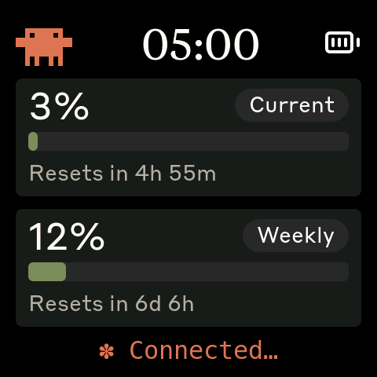
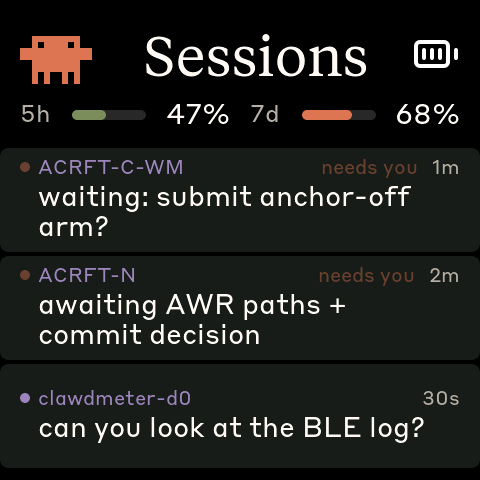
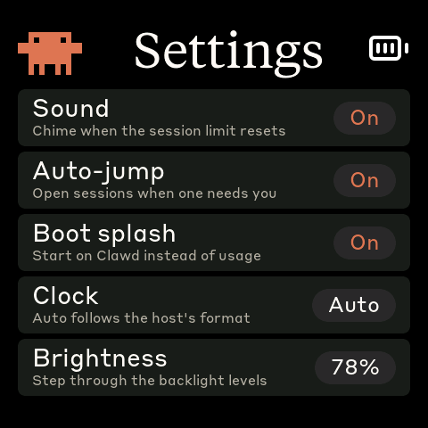
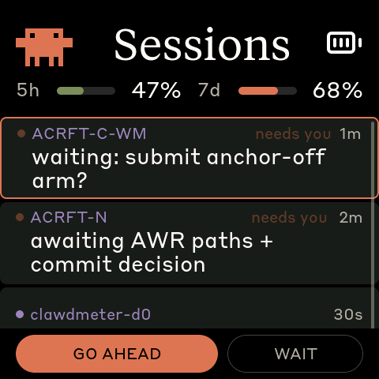
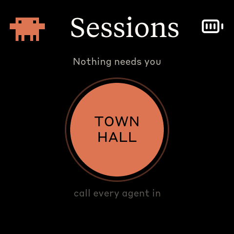

# Clawdmeter


A small ESP32 dashboard I made for my desk to keep an eye on Claude Code usage.

It runs on a [Waveshare ESP32-S3-Touch-AMOLED-2.16](https://www.waveshare.com/esp32-s3-touch-amoled-2.16.htm?&aff_id=149786) as well as a few other alternative boards and pairs over Bluetooth, the splash screen plays pixel-art Clawd animations that get
busier when your usage rate climbs. It also shows the Claude Code sessions that
need you — including agents on other machines — and lets you answer them from
the panel.


## Screens

Screens are tabs. **Swipe horizontally to move between them** — left for the next tab, right for the previous, wrapping at both ends. On the splash and usage screens a tap still flips between the two; the sessions and settings tabs are read and tapped instead, so you swipe off those.

|              Splash               |              Usage              |
| :-------------------------------: | :-----------------------------: |
|  |  |
|   Pixel-art Clawd, reacting to how hard you're working    | Session and weekly utilization  |

|                Sessions                 |                Settings                 |
| :-------------------------------------: | :-------------------------------------: |
|    |    |
| Only what needs a person: agent reports and messages | On-device preferences, saved to flash |

|                Tap a card                     |               Nothing waiting                |
| :-------------------------------------------: | :------------------------------------------: |
|    |        |
| Go ahead, or leave it for the keyboard        | The town hall button calls the fleet in      |

The **Sessions** tab is not a roster. It shows only what needs a person, which on most days is nothing:

- a Claude Code session **blocked on you** — a permission prompt, a question, an error;
- a **message another session sent you** (the cross-session `SendMessage` channel);
- an **agent report** — an answer to a round you called, saying what that agent is doing and whether it is stuck.

Everything idle or busy is dropped on the host before it costs a byte of the payload, so an empty tab means a calm desk rather than a broken feed. When something does start waiting, the device **jumps to this tab on its own** so you notice from across the room. That jump fires once per event, never repeatedly, and it leaves you alone while you are on the Settings tab. When the last waiting session clears it hands the screen back to where you were about ten seconds later — unless you touched the panel in the meantime. Turn it off in Settings if you would rather it stayed put.

**Tap a card and it offers what can be done with it.** A report that says an agent has stopped and is waiting for direction gets **GO AHEAD**, which sends that agent one message telling it to continue — the panel is four inches wide, so it deliberately says nothing more specific than that. Everything else gets **DISMISS**. Both cards also offer **WAIT**, which is the answer most of the time: it sends nothing, clears nothing, and leaves the card exactly where it is, because you are going to answer that session on a keyboard. **The card then disappears when the session actually moves**, not when you have finished looking at it — the tab mirrors what is true elsewhere, so a card still on screen means a session that still needs somebody.

**When there is nothing waiting, the empty space holds the town hall button.** Press it and the host asks every reachable agent to report in; a few seconds later their answers arrive as cards. It exists only on the empty view, and that is deliberate: with cards on screen the meeting has already happened and its minutes are what you are reading. See [`daemon/REPORT.md`](daemon/REPORT.md) for the reply contract and what a round costs.

This tab needs a session source on the host. Two exist: the **hook sidecar** for sessions on this machine ([`daemon/SESSIONS.md`](daemon/SESSIONS.md)) and the **fleet poller** for remote-control sessions, cross-session mail and agent reports ([`daemon/FLEET.md`](daemon/FLEET.md)). Without either, the tab is still in the swipe ring but has nothing to list; boards too small to host chat cards never have it in their swipe order at all. More cards than fit will scroll: drag the list vertically — the swipe ring only listens to horizontal drags, so the two never fight.

The **Settings** tab holds the preferences that used to require a reflash: the reset chime and its volume, auto-jump, whether the device boots to the splash, the clock format, and screen brightness. Each one is written to flash the moment you change it, so they survive a power cut. Rows that a board cannot honour are not shown at all, so a port with no speaker has no chime rows.

While the splash is up, the PWR button cycles animations. **Hold the power button for 3 seconds, then release, to put the device into pairing mode** — this clears the saved Bluetooth bond and re-advertises. The firmware also auto-rotates animations every 20 s within the current usage-rate group, so a long stretch on the splash isn't just one Clawd on loop.

> Every screenshot above is a real frame from the firmware, captured headlessly from the desktop simulator (`-e sim`) — the same `ui.cpp` that runs on the panel. See [`SIM-USAGE.md`](SIM-USAGE.md) to run it yourself.

## Hardware

Boards supported out of the box:

- [Waveshare ESP32-S3-Touch-AMOLED-2.16](https://www.waveshare.com/esp32-s3-touch-amoled-2.16.htm?&aff_id=149786)
- [Waveshare ESP32-C6-Touch-AMOLED-2.16](https://www.waveshare.com/esp32-c6-touch-amoled-2.16.htm?&aff_id=149786)
- [Waveshare ESP32-S3-Touch-AMOLED-1.8](https://www.waveshare.com/esp32-s3-touch-amoled-1.8.htm?&aff_id=149786)
- [Waveshare ESP32-C6-Touch-AMOLED-1.8](https://www.waveshare.com/esp32-c6-touch-amoled-1.8.htm?&aff_id=149786)
- [Waveshare ESP32-S3-Touch-AMOLED-2.06](https://www.waveshare.com/esp32-s3-touch-amoled-2.06.htm?&aff_id=149786)
- [Waveshare ESP32-S3-Touch-LCD-1.54](https://www.waveshare.com/esp32-s3-lcd-1.54.htm?sku=33869&aff_id=149786)
- [Waveshare ESP32-S3-Touch-LCD-4](https://www.waveshare.com/esp32-s3-touch-lcd-4.htm)

> Please check if a pull request exists for your alternative hardware port before opening a new one, providing QA feedback and testing on the same hardware is more valuable than duplicate pull requests.

**Porting to another board:** the firmware is a thin HAL with per-board folders under `firmware/src/boards/`. Drop in a new folder and a new PlatformIO env — `main.cpp`, `ui.cpp`, and `splash.cpp` never need to change. See [`docs/porting/adding-a-board.md`](docs/porting/adding-a-board.md) for the walk-through and [`docs/porting/hal-contract.md`](docs/porting/hal-contract.md) for the interfaces a port must implement.

## Prerequisites

- Linux (tested on Ubuntu), macOS, or Windows 10/11
- [PlatformIO CLI](https://docs.platformio.org/en/latest/core/installation/index.html)
- Linux: `curl`, `bluetoothctl`, `busctl` (BlueZ Bluetooth stack)
- macOS: `python3` (the installer sets up a venv with `bleak` and `httpx`)
- Windows: `python3` 3.11+ (the installer sets up a venv with `bleak`, `httpx`, and `pystray`)
- Claude Code with an active subscription

## macOS installation

The macOS host pieces — Python daemon, LaunchAgent, and flash helper — were ported by [Chris Davidson (@lorddavidson)](https://github.com/lorddavidson). Thanks Chris!

### Flash the firmware

```bash
./flash-mac.sh waveshare_amoled_216                       # ESP32-S3 2.16" (auto-detects /dev/cu.usbmodem*)
./flash-mac.sh waveshare_amoled_216_c6                    # ESP32-C6 2.16" variant
./flash-mac.sh waveshare_amoled_18  /dev/cu.usbmodem1101  # ESP32-S3 1.8" (or pass an explicit USB serial port)
```

The board env name is required. Run `./flash-mac.sh` with no args to see the available envs (scraped from `firmware/platformio.ini`).

### Pair the device

After flashing, open **System Settings → Bluetooth** and click _Connect_ next to "Clawdmeter". The daemon only ever connects to the peripheral this Mac is paired/connected to — it never scans for a nearby device — so once it's connected here the daemon picks it up on its next poll (~60 s).

### Install the daemon

The daemon reads your Claude OAuth token from the macOS Keychain (service `Claude Code-credentials`), polls usage every 60 s, and pushes it to the display over BLE.

```bash
./install-mac.sh
```

The installer creates a Python venv in `daemon/.venv/`, installs `bleak` and `httpx`, renders a LaunchAgent into `~/Library/LaunchAgents/com.user.claude-usage-daemon.plist`, and loads it. The first run is launched interactively so macOS prompts for Bluetooth permission.

Useful commands:

```bash
launchctl list | grep claude-usage                                          # check it's running
tail -F ~/Library/Logs/claude-usage-daemon.out.log                          # live logs
launchctl unload ~/Library/LaunchAgents/com.user.claude-usage-daemon.plist  # stop
launchctl load -w ~/Library/LaunchAgents/com.user.claude-usage-daemon.plist # start
```

## Linux installation

### Flash the firmware

```bash
./flash.sh waveshare_amoled_216                  # ESP32-S3 2.16" (defaults to /dev/ttyACM0)
./flash.sh waveshare_amoled_216_c6               # ESP32-C6 2.16" variant
./flash.sh waveshare_amoled_18  /dev/ttyACM1     # ESP32-S3 1.8" (or pass an explicit USB serial port)
```

The board env name is required. Run `./flash.sh` with no args to see the available envs (scraped from `firmware/platformio.ini`).

### Pair the device

After flashing, the device advertises as "Clawdmeter". Pair it once:

```bash
# Scan for the device
bluetoothctl scan le

# When "Clawdmeter" appears, pair and trust it
bluetoothctl pair F4:12:FA:C0:8F:E5    # use your device's MAC
bluetoothctl trust F4:12:FA:C0:8F:E5
```

To re-pair later, hold the power button for 3 seconds then release — the device clears its saved bond and re-advertises.

### Install the daemon

The daemon polls your Claude usage every 60 seconds and sends it to the display over BLE.

```bash
./install.sh
systemctl --user start claude-usage-daemon
```

Check status: `systemctl --user status claude-usage-daemon`

View logs: `journalctl --user -u claude-usage-daemon -f`

## Windows installation

Runs natively on Windows — no WSL required. A system-tray app polls your usage and pushes it over BLE, and starts automatically at login.

### Prerequisites

- **Native Windows** (not WSL).
- **Python 3.11+** from [python.org](https://www.python.org/downloads/) — check _"Add python.exe to PATH"_ during install.
- **Claude Code** installed, with `claude login` completed. The token is read from `%USERPROFILE%\.claude\.credentials.json` (falling back to `%LOCALAPPDATA%\Claude\` then `%APPDATA%\Claude\`).
- The repo on a **native Windows path** (e.g. `%USERPROFILE%\Clawdmeter`), **not** a `\\wsl$` share — the installer refuses a WSL path.

### Flash the firmware

```powershell
pio run -d firmware -e waveshare_amoled_216 -t upload --upload-port COM5   # use your device's COM port
```

Run `pio run -d firmware` with no env to see the available board envs.

### Pair the device

The device is a bonded BLE HID keyboard, so pair it once: **Settings → Bluetooth & devices → Add device → Bluetooth**, then select "Clawdmeter". Pairing is **required** — it enables the physical buttons and keeps a persistent connection (the device keeps showing your last-synced usage even after the daemon quits). To undo, use **Remove device** (this disables the buttons).

### Install the daemon (recommended)

From the repo root in PowerShell:

```powershell
powershell -ExecutionPolicy Bypass -File install-windows.ps1
```

This creates a venv, installs `bleak`/`httpx`/`pystray`/`Pillow` from the in-repo requirements (no internet downloads), registers a per-user login-autostart entry (`HKCU\…\Run`, no admin needed), and launches the tray app headlessly (no console window).

### Run manually instead (optional)

```powershell
python -m venv .venv
.venv\Scripts\Activate.ps1        # if blocked: Set-ExecutionPolicy -Scope CurrentUser RemoteSigned, then retry
pip install -r daemon\requirements-windows.txt
python daemon\claude_usage_daemon_windows.py        # runs in the foreground; Ctrl+C to stop
```

### Tray icon and menu

The icon's corner bubble shows state — **green** Connected, **amber** Scanning, **red** Error — and hovering shows the status (`Connected · last update HH:MM`). A notification fires once when it enters Error (e.g. an expired token). Right-click for the menu:

- **Status header** — live state + last sync time.
- **Start at login** — toggle autostart on/off.
- **Quit** — stops the daemon cleanly; leaves the Windows pairing intact (device keeps its last reading).

### Logs and troubleshooting

```powershell
Get-Content $env:LOCALAPPDATA\Clawdmeter\daemon.log -Tail 30        # view logs
reg delete "HKCU\Software\Microsoft\Windows\CurrentVersion\Run" /v Clawdmeter /f   # remove autostart
```

| Symptom                                | Fix                                                      |
| -------------------------------------- | -------------------------------------------------------- |
| `Device not found`                     | Power on the device; make sure it's in range and paired. |
| `token expired` toast / `API HTTP 401` | Re-run `claude login`, then restart the daemon.          |
| `Connection failed`                    | Toggle Windows Bluetooth off/on in Settings.             |
| `Warning: running under Linux/WSL`     | Run from a native PowerShell window, not a WSL shell.    |

## How it works


1. The daemon reads your Claude Code OAuth token — from the macOS Keychain (service `Claude Code-credentials`) on macOS, or from `~/.claude/.credentials.json` on Linux (`%USERPROFILE%\.claude\.credentials.json` on Windows).
2. It makes a minimal API call to `api.anthropic.com/v1/messages` — one token of Haiku, basically free.
3. The usage numbers come straight out of the response headers (`anthropic-ratelimit-unified-5h-utilization` and friends).
4. The daemon connects to the ESP32 over BLE and writes a JSON payload to the GATT RX characteristic.
5. The firmware parses it and updates the LVGL dashboard.
6. The firmware also tracks the rate of change of session % over a 5-minute window and picks splash animations from the matching mood group.
7. Traffic goes the other way too: the device notifies the daemon when you press a button or tap a card, and the daemon acts on it — running a report round, or passing your "go ahead" to the agent on that card.

## Physical buttons

The board has three side buttons.

| Button           | GPIO         | Function                                                     |
| ---------------- | ------------ | ------------------------------------------------------------ |
| **Left**         | GPIO 0       | Hold to send Space (Claude Code voice-mode push-to-talk)     |
| **Middle** (PWR) | AXP2101 PKEY | On splash: cycle animations. Hold 3s + release: pairing mode |
| **Right**        | GPIO 18      | Wakes the panel; no other action                             |

Space goes out as a standard BLE HID keyboard report, so it triggers in whatever window has focus on the paired host — not just Claude Code.

The right button used to send Shift+Tab the same way, then briefly called a report round, and now does neither. Both were the wrong thing to put behind a side button: Shift+Tab typed into whatever window happened to have focus, and a round spends quota on other people's machines for a press a sleeve can make. Calling the fleet in is the **town hall button on the Sessions tab** — a deliberate control you have to look at.

## BLE protocol

The device advertises a custom GATT service alongside the standard HID keyboard service:

|                                | UUID                                   |
| ------------------------------ | -------------------------------------- |
| **Data Service**               | `4c41555a-4465-7669-6365-000000000001` |
| RX — usage payload (write)     | `4c41555a-4465-7669-6365-000000000002` |
| TX — acks and device events    | `4c41555a-4465-7669-6365-000000000003` |
| REQ — "send me data" (notify)  | `4c41555a-4465-7669-6365-000000000004` |
| SS — session rows (write)      | `4c41555a-4465-7669-6365-000000000005` |
| **HID Service**                | `00001812-0000-1000-8000-00805f9b34fb` |

JSON payload format (written to RX):

```json
{ "s": 45, "sr": 120, "w": 28, "wr": 7200, "st": "allowed", "ok": true }
```

Fields: `s` = session %, `sr` = session reset (minutes), `w` = weekly %, `wr` = weekly reset (minutes), `st` = status, `ok` = success flag.

Session rows go to **SS** as a positional array — see [`daemon/SESSIONS.md`](daemon/SESSIONS.md) for the field order, which is append-only so an older device and a newer host still understand each other.

**TX carries device → host events**, which is how the buttons and the card taps reach the daemon:

```json
{"ev":1}                 run a report round
{"ev":2,"sid":"g4"}      go ahead, to the agent on that card
{"ev":3,"sid":"g4"}      dismiss that card
```

`ev` is the discriminator — the ack traffic TX has always carried does not have it, so a subscriber that sees no `ev` knows it is looking at an ack. Every TX notification goes to the **bonded owner only**, on an encrypted link, per connection handle: the channel now carries presses, and NimBLE's plain `notify()` would fan them out to anyone who subscribed.

## Development


- **Desktop simulator** — iterate on the UI without hardware: an SDL2 window
  runs the full firmware loop with scenario playback (`pio run -d firmware -e
sim`, then `cd firmware && .pio/build/sim/program`). See
  [`SIM-USAGE.md`](SIM-USAGE.md) for controls, scenarios, and headless
  screenshots.
- **Splash animations** — Anthropic's official Clawd sprites, archived with
  provenance notes in [`research/clawd-official/`](research/clawd-official/);
  `node tools/convert_official_clawd.js` regenerates
  `firmware/src/splash_animations.h`. See [`tools/README.md`](tools/README.md).
- **Icons** — Lucide PNGs convert to LVGL C arrays with
  `tools/png_to_lvgl.js`. See [`tools/README.md`](tools/README.md).
- **Fonts** — the pre-compiled LVGL fonts and the LVGL-9 patching they need:
  [`docs/fonts.md`](docs/fonts.md).
- **Porting** — [`docs/porting/adding-a-board.md`](docs/porting/adding-a-board.md)
  and [`docs/porting/hal-contract.md`](docs/porting/hal-contract.md).

## Credits

- Pixel-art Clawd animations are Anthropic's official mascot art (claude.ai/code, Claude Code desktop), archived and converted by the tooling in `tools/` and `research/clawd-official/`.
- Lucide icon set ([lucide.dev](https://lucide.dev), MIT) for bluetooth and battery UI glyphs.
- Anthropic brand fonts (Tiempos Text, Styrene B) — see licensing warning below.
- **NanumGothic** by Sandoll Communications for Naver (NHN), under the [SIL Open Font License 1.1](assets/OFL.txt) — the Korean glyphs a message body falls back to (`firmware/src/font_nanum_kr_28.c`, derived from `assets/NanumGothic-Regular.ttf` as taken from Google Fonts' `ofl/nanumgothic/`). The OFL requires its text to travel with the font, so `assets/OFL.txt` ships beside it. See [`docs/fonts.md`](docs/fonts.md#korean-typeface--licence).

## Licensing gray area warning

The software in this repository uses and adheres to the Anthropic brand guidelines and uses the same proprietary fonts that Anthropic has a license for but this software uses without permission as well as using assets from Anthropic such as the copyrighted Clawd mascot so even though the code in this repo is non-proprietary I will not license it myself under a copyleft license since this repo includes proprietary fonts and copyrighted assets. Please be aware of this if you fork or copy the code from this repo. **You have been warned!**
